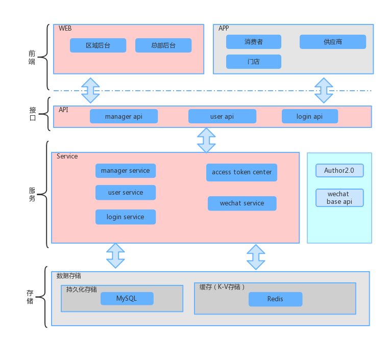
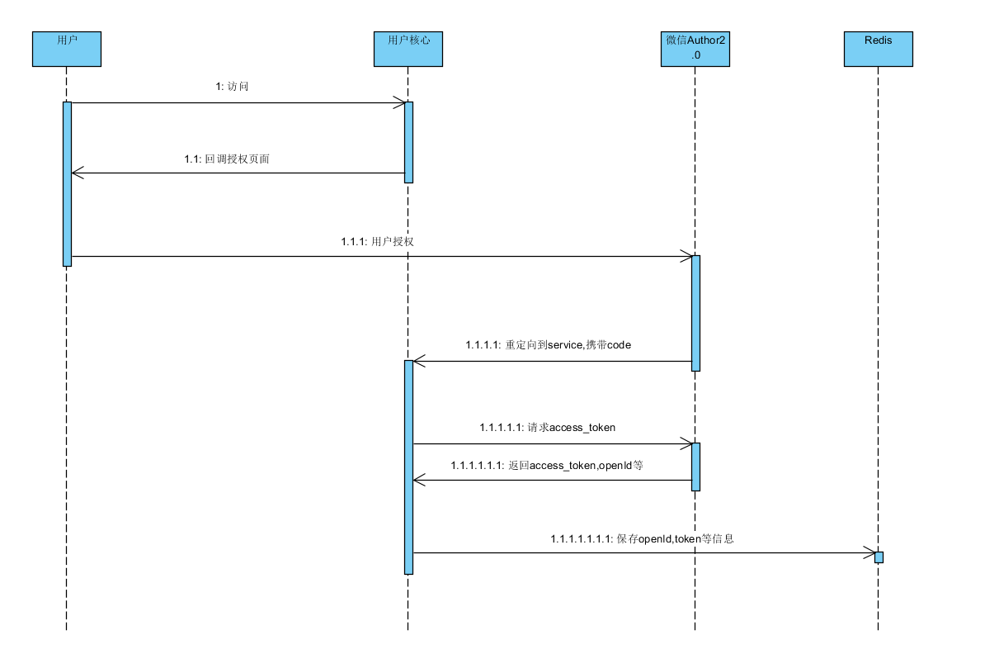
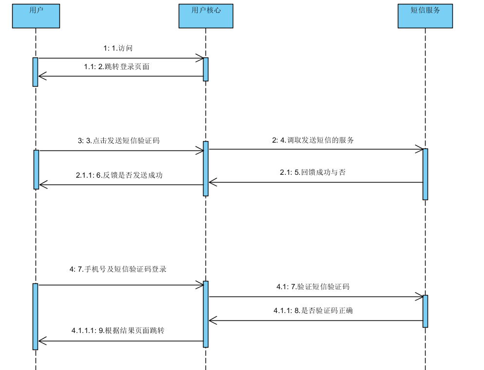

# 用户核心-技术方案设计
***

## 修订记录

| 完成日期       | 作者   | 版本   | 变化状态 | 变更内容及范围 |
| ---------- | ---- | ---- | ---- | ------- |
| 2018/01/15 | 付龙   | 1.0  | A    | 文档新增    |

修订记录 
变化状态：A – 新增 M – 修改 D – 删除

### 名词解释

| 名词   | 定义   |
| ---- | ---- |
|      |      |
|      |      |

### 项目背景
***

- 定位：满足消费者，供应商，门店，区域以及总部后台的管理者的信息维护
  需求：优选平台的各级角色的信息维护，微信授权及登录，获取授权用户个人信息等
### 系统架构

***

##### 整体系统架构图

==

描述：

1.接口层：

​	1）**manager api**:提供区域及总部后台的用户请求响应

​	2）**user api**:提供app端的用户请求响应

​	3）**login api**:提供app端登录注册请求响应

2.服务层：

​	1）**access token center**:提供主动刷新和被动刷新机制来刷新accessToken并存储，提供给业务逻辑有效		的accessToken。

​	2）**wechat service**:专一与微信API对接

### 业务主流程

***

#### xxx主流程
流程图 ＋ 文字说明

### 系统核心业务逻辑
***

#### 微信授权

#### 用户登录及注册

注意：

​	1.判断用户是否已注册，若已注册则为登录，若无则为注册及登录

​	2.注册时添加用户信息为分库分表	

### 接口设计

***

### login api

#### 消费者登录及注册

请求参数：

| 元素名称  | 类型     | 长度   | 字段名   | 是否为空 | 说明                            |
| ----- | ------ | ---- | ----- | ---- | ----------------------------- |
| tel   | String | 20   | 手机号   | N    | 手机号必填                         |
| code  | String | 6    | 短信验证码 | N    | 短信验证码                         |
| token | String | 50   | token | N    | 用于获取redis中openId，access_token |

响应返回结果：

| 元素名称   | 类型     | 长度   | 字段名  | 是否为空 | 说明   |
| ------ | ------ | ---- | ---- | ---- | ---- |
| rspCd  | String | 64   | 返回码  | N    | 返回码  |
| rspInf | String | 200  | 返回信息 | N    | 返回信息 |

#### 供应商，门店登录

请求参数：

| 元素名称     | 类型     | 长度   | 字段名  | 是否为空 | 说明                  |
| -------- | ------ | ---- | ---- | ---- | ------------------- |
| userName | String | 100  | 用户名  | N    |                     |
| pwd      | String | 50   | 密码   | N    |                     |
| type     | String | 50   | 登录类型 | N    | store:门店 vendor:供应商 |

响应返回结果：

| 元素名称   | 类型     | 长度   | 字段名  | 是否为空 | 说明   |
| ------ | ------ | ---- | ---- | ---- | ---- |
| rspCd  | String | 64   | 返回码  | N    | 返回码  |
| rspInf | String | 200  | 返回信息 | N    | 返回信息 |

### 数据库设计

***

#### t_user 

| 字段名               | 类型           | 是否为空 | 说明                                       |
| ----------------- | ------------ | ---- | ---------------------------------------- |
| userId            | bigint       | N    | 用户编号                                     |
| userName          | varchar(256) |      | 用户名称                                     |
| alias             | varchar(256) |      | 别名                                       |
| mobileNo          | varchar(16)  |      | 手机号                                      |
| wechatNo          | varchar(64)  |      | 绑定的微信号                                   |
| wechatImage       | varchar(250) |      | 微信头像                                     |
| wechatNickName    | varchar(64)  |      | 微信昵称                                     |
| wechatLoginStatus | char(1)      |      | 微信登录状态 N：否 Y：是                           |
| pwd               | varchar(128) |      | 密码                                       |
| pwdFormat         | int(1)       |      | 密码格式                                     |
| pwdSalt           | varchar(128) |      | 密码盐值                                     |
| email             | varchar(256) |      | 邮箱                                       |
| status            | varchar(16)  |      | 状态：审核：auditing 正常：normal 冻结：frozen 删除：delete |
| gender            | char(1)      |      | 性别 F:女 M:男                               |
| birthday          | datetime     |      | 生日                                       |
| userType          | varchar(10)  | N    | 用户类型（会员：member,门店：store）                 |
| openId            | varchar(128) |      | 开放id                                     |
| openType          | varchar(16)  |      | 开放类型（wechat:微信，alipay:支付宝）               |
| pwdIntensity      | char(1)      |      | 密码强度 L:低 M:中 H:高                         |
| shareStoreId      | bigint(19)   | N    | 门店分享ID号（会员注册时从门店分享的链接带入的门店分享ID号）         |
| tmModifyPwd       | datetime     |      | 最后修改密码时间                                 |
| currentStoreId    | bigint(19)   | N    | 当前所在门店编号                                 |
| tmCreate          | datetime     | N    | 创建时间                                     |
| tmSmp             | timestamp    | N    | 修改时间                                     |

### 现有系统影响分析

***

#### xxx系统影响分析

#### xxx系统影响分析

### 运维分析

***

对数据库影响是否有特殊要求，对机器、网络、配置是否有要求跟配置。

系统监控、业务监控、系统日志、灾备等。

### 非功能性分析

***

系统响应分析、并发访问分析、可测性分析、系统容错分析（版本兼容等）
